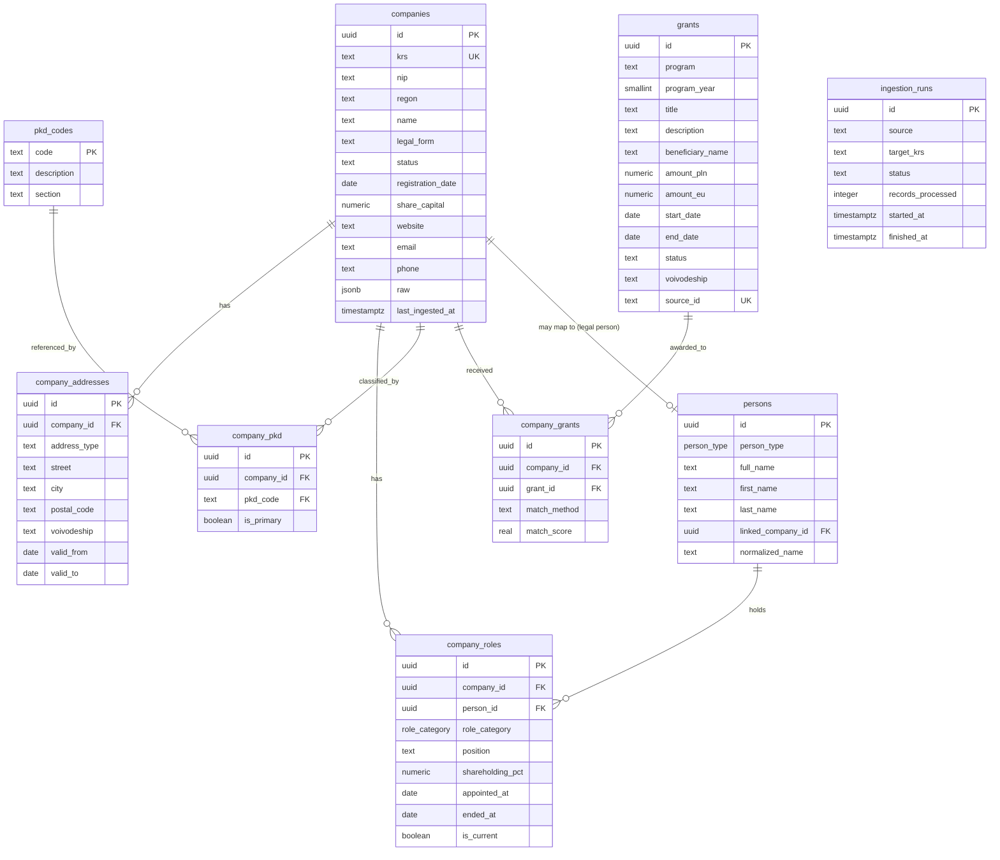

# Firmobase — Entity Relationship Diagram

Core company registry + financials + grants. All tables keyed by internal UUID.

## Design notes

- **`companies.krs`** is the natural key from eKRS (10 digits, leading zeros preserved as text). Unique but nullable so a company discovered by NIP/name before its KRS is resolved can still be inserted.
- **`persons`** holds *both* natural people and legal entities that hold roles. When a role-holder is itself a tracked company, `linked_company_id` connects them — this is the seed of the Phase 5 relationship graph (company → person → company).
- **`company_roles`** is temporal (`appointed_at` / `ended_at` / `is_current`) so we keep full board/shareholder history, not just the current snapshot.
- **`company_addresses`** is temporal too (`valid_from` / `valid_to`) for address-change timelines.
- **`raw` jsonb** columns store the original source payload so we can reprocess without re-fetching when the parser improves.
- **Search:** `pg_trgm` GIN indexes on `companies.name` and `persons.normalized_name` give typo tolerance and autocomplete now; Phase 2 layers `tsvector` full-text on top.
